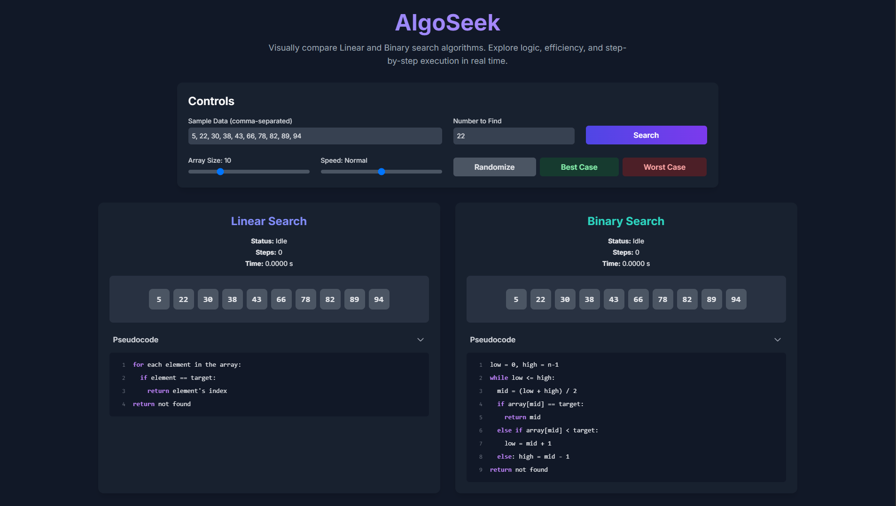
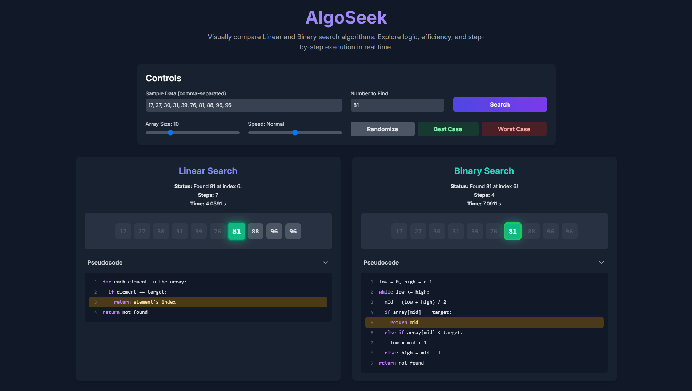

# AlgoSeek: Linear vs Binary Search Visualization

## Overview

AlgoSeek is an interactive web application designed to visually compare the Linear Search and Binary Search algorithms. It allows users to explore the logic, efficiency, and step-by-step execution of both algorithms in real time. Users can input custom data, adjust array sizes, control animation speed, and test best-case or worst-case scenarios to better understand how these algorithms perform.

## Features

- **Interactive Visualization**: Watch Linear and Binary Search algorithms execute step-by-step on a given dataset.
- **Customizable Input**: Enter comma-separated numbers and specify a target number to search for.
- **Controls**: Adjust array size, animation speed, randomize data, or select best/worst-case scenarios.
- **Performance Metrics**: View real-time updates on search status, step count, and execution time.
- **Pseudocode Display**: Understand the logic behind each algorithm with accompanying pseudocode.

## Live Demo

[algoseek.pages.dev](https://algoseek.pages.dev)

## Team Members

| Name               | GitHub Profile                                         |
| ------------------ | ------------------------------------------------------ |
| Muhd Amreel Amsyar | [github.com/SyNhwang](https://github.com/SyNhwang)     |
| Amir               | [github.com/itsmeEVIL](https://github.com/itsmeEVIL)   |
| Adam Mukhlis       | [github.com/Damsuh88](https://github.com/Damsuh88)     |
| Muhammad Abil      | [github.com/username4](https://github.com/username4)   |
| Najmin Faiz        | [github.com/quackedudu](https://github.com/quackedudu) |

## Screenshots

|   |
| ---------------------- |
|  |
